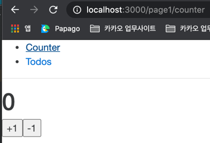

# 리액트 예제 프로젝트
1. 리덕스로 상태관리
2. 리덕스 사가로 비동기작업 처리  
   (모든 비동기 작업은 임시로 1초 딜레이 설정된 상태)
3. 리액트 라우터로 라우팅 처리
4. Loadable Components 로 코드 스플리팅 처리

### 로컬구동방법
1. nvm 설치
    ```
    curl -o- https://raw.githubusercontent.com/nvm-sh/nvm/v0.37.2/install.sh | bash
    ```

2. node 설치
   ```
   nvm install --lts
   ```
   
3. yarn 설치
   ```
   brew update
   brew install yarn
   ```
   
4. 가상 api 서버 실행
   ```
   json-server --watch fake-server/todosRest.json --port 3001
   ```
   fake-server/todoRest.http로 가상api 서버에 api요청을 해볼 수 있다.


5. 어플리케이션 구동
   ```
   yarn start
   ```



## **더 자세한 내용은 [위키](https://wiki.daumkakao.com/pages/viewpage.action?pageId=745796758) 를 참고하도록 한다.**
