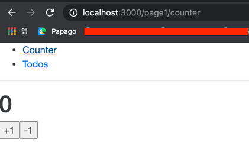

# 리액트 예제 프로젝트
1. 리덕스로 상태관리
2. 리덕스 사가로 비동기작업 처리  
   (모든 비동기 작업은 임시로 1초 딜레이 설정된 상태)
3. 리액트 라우터로 라우팅 처리
4. Loadable Components 로 코드 스플리팅 처리

### 추가 모듈 설치
1. 크롬 브라우저 디버깅 관련 라이브러리 설치  
```
yarn add redux-devtools-extension   #Redux DevTools 과 연동됨  
yarn add redux-logger    #console에 리덕스 상태변경 히스토리 출력
```

2. 테스트용 api서버 구축을 위한 라이브러리 설치
```
yarn global add json-server   #어플리케이션에 포함할게 아니기 때문에 global로 설치한다.
```

3. 상태 관리를 위한 리덕스 라이브러리 설치
```
yarn add redux react-redux
yarn add redux-actions
yarn add immer
```

4. restApi 비동기처리를 위한 리덕스 사가 등의 라이브러리 설치
```
yarn add redux-saga
yarn add axios
yarn add qs
yarn add react-loading
```

5. 라우팅 처리를 위한 라이브러리 설치
```
yarn add react-router-dom
```

6. 컴포넌트 코드 스플리팅을 위한 라이브러리 설치
```
yarn add @loadable/component
```

7. CSS-in-JS를 위한 라이브러리 설치
```
yarn add styled-components
```

### import 절대경로로 지정하기  
리액트에서 다른 js 파일을 import 할때 기본적으로 아래와 같이 상대경로로 지정해야 한다.
```
import { startLoading, finishLoading } from '../../modules/loading';
```
이것도 좀 지져분한데 Depth 가 더 깊어질 경우 ../../../ 이 굉장히 길어진다.

하지만 몇가지 설정으로 절대경로로 import 할 수 있는 방법을 제공한다.
프로젝트 root에 jsconfig.json파일을 생성하고 아래와 같이 입력한다.
```
{
    "compilerOptions": {
        "baseUrl": "src"
    },
    "include": [
        "src"
    ]
}
```

이제 src 디렉토리를 기준점으로 해서 아래와 같이 import 할 수 있다.
```
import { startLoading, finishLoading } from 'modules/loading';
```

### 로컬구동방법
1. nvm 설치
    ```
    curl -o- https://raw.githubusercontent.com/nvm-sh/nvm/v0.37.2/install.sh | bash
    ```

2. node 설치
   ```
   nvm install --lts
   ```
   
3. yarn 설치
   ```
   brew update
   brew install yarn
   ```
   
4. 가상 api 서버 실행
   ```
   json-server --watch fake-server/todosRest.json --port 3001
   ```
   fake-server/todoRest.http로 가상api 서버에 api요청을 해볼 수 있다.


5. 어플리케이션 구동
   ```
   yarn start
   ```


